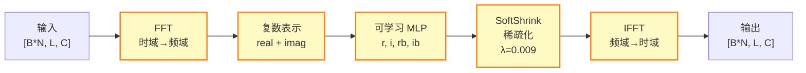
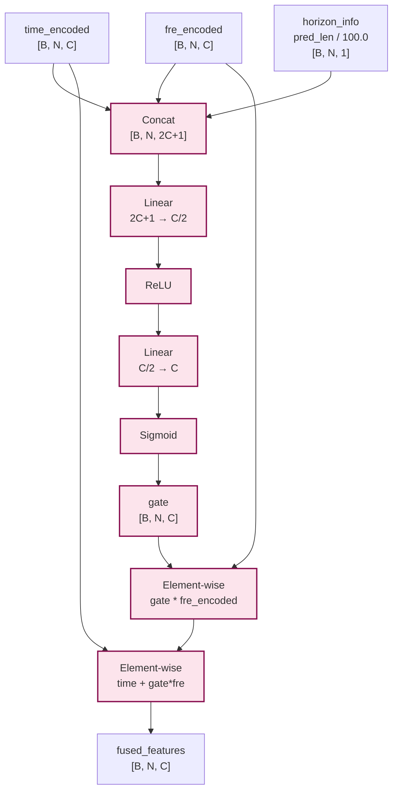
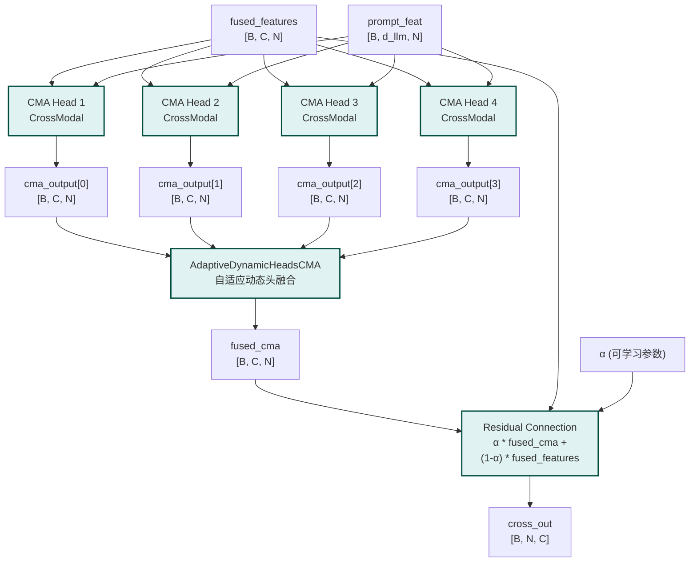
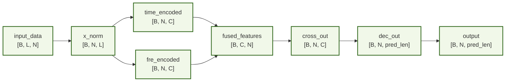

# T3Time_FreTS_Gated_Qwen 网络架构图 (Mermaid)

```mermaid
graph TB
    %% 输入层
    InputData["input_data<br/>[B, L, N]"]
    Embeddings["embeddings<br/>[B, d_llm, N, 1]"]
    
    %% RevIN 归一化
    RevINNorm["RevIN 归一化<br/>Normalize('norm')"]
    Reshape1["Reshape<br/>[B, N, L]"]
    Reshape2["Reshape<br/>[B, N, d_llm]"]
    
    %% 时域分支
    TimeLinear["Linear<br/>L → C<br/>length_to_feature"]
    TimeEncoder["GatedTransformerEncoder<br/>× e_layer<br/>ts_encoder"]
    TimeEncoded["time_encoded<br/>[B, N, C]"]
    
    %% 频域分支
    FreReshape["Reshape<br/>[B*N, L, 1]"]
    FreProjection["Linear<br/>1 → C<br/>fre_projection"]
    FreTS["FreTS Component<br/>FFT → MLP → IFFT<br/>sparsity=0.009"]
    FrePool["AttentionPooling<br/>fre_pool"]
    FreEncoder["GatedTransformerEncoder<br/>fre_encoder"]
    FreEncoded["fre_encoded<br/>[B, N, C]"]
    
    %% Prompt 编码
    PromptEncoder["GatedTransformerEncoder<br/>× e_layer<br/>prompt_encoder"]
    PromptFeat["prompt_feat<br/>[B, d_llm, N]"]
    
    %% Gate 融合
    HorizonInfo["horizon_info<br/>pred_len / 100.0"]
    GateConcat["Concat<br/>[time, fre, horizon]"]
    GateMLP["MLP + Sigmoid<br/>fusion_gate"]
    GateFusion["Gate Fusion<br/>time + gate * fre"]
    FusedFeatures["fused_features<br/>[B, C, N]"]
    
    %% CMA
    CMAHead1["CMA Head 1<br/>CrossModal"]
    CMAHead2["CMA Head 2<br/>CrossModal"]
    CMAHead3["CMA Head 3<br/>CrossModal"]
    CMAHead4["CMA Head 4<br/>CrossModal"]
    AdaptiveCMA["AdaptiveDynamicHeadsCMA<br/>自适应融合"]
    Residual["Residual Connection<br/>α * fused_cma +<br/>(1-α) * fused"]
    CrossOut["cross_out<br/>[B, N, C]"]
    
    %% 解码器
    Decoder["TransformerDecoder<br/>× d_layer"]
    CToLength["Linear<br/>C → pred_len<br/>c_to_length"]
    DecOut["dec_out<br/>[B, N, pred_len]"]
    
    %% 输出
    RevINDenorm["RevIN 反归一化<br/>Normalize('denorm')"]
    Output["Output<br/>[B, N, pred_len]"]
    
    %% 连接关系
    InputData --> RevINNorm
    RevINNorm --> Reshape1
    
    Embeddings --> Reshape2
    Reshape2 --> PromptEncoder
    PromptEncoder --> PromptFeat
    
    Reshape1 --> TimeLinear
    TimeLinear --> TimeEncoder
    TimeEncoder --> TimeEncoded
    
    Reshape1 --> FreReshape
    FreReshape --> FreProjection
    FreProjection --> FreTS
    FreTS --> FrePool
    FrePool --> FreEncoder
    FreEncoder --> FreEncoded
    
    TimeEncoded --> GateConcat
    FreEncoded --> GateConcat
    HorizonInfo --> GateConcat
    GateConcat --> GateMLP
    GateMLP --> GateFusion
    GateFusion --> FusedFeatures
    
    FusedFeatures --> CMAHead1
    FusedFeatures --> CMAHead2
    FusedFeatures --> CMAHead3
    FusedFeatures --> CMAHead4
    PromptFeat --> CMAHead1
    PromptFeat --> CMAHead2
    PromptFeat --> CMAHead3
    PromptFeat --> CMAHead4
    
    CMAHead1 --> AdaptiveCMA
    CMAHead2 --> AdaptiveCMA
    CMAHead3 --> AdaptiveCMA
    CMAHead4 --> AdaptiveCMA
    AdaptiveCMA --> Residual
    FusedFeatures --> Residual
    Residual --> CrossOut
    
    CrossOut --> Decoder
    Decoder --> CToLength
    CToLength --> DecOut
    DecOut --> RevINDenorm
    RevINDenorm --> Output
    
    %% 样式
    classDef inputStyle fill:#e1f5ff,stroke:#01579b,stroke-width:2px
    classDef processStyle fill:#f3e5f5,stroke:#4a148c,stroke-width:2px
    classDef fusionStyle fill:#fff3e0,stroke:#e65100,stroke-width:2px
    classDef outputStyle fill:#e8f5e9,stroke:#1b5e20,stroke-width:2px
    
    class InputData,Embeddings inputStyle
    class TimeLinear,TimeEncoder,FreProjection,FreTS,FrePool,FreEncoder,PromptEncoder,Decoder,CToLength processStyle
    class GateConcat,GateMLP,GateFusion,CMAHead1,CMAHead2,CMAHead3,CMAHead4,AdaptiveCMA,Residual fusionStyle
    class Output outputStyle
```



## FreTS Component 详细结构



## Gate 融合机制详细流程



## CMA (Cross-Modal Alignment) 详细流程



## 数据流维度变化



## 完整架构流程图（简化版）

```mermaid
flowchart TD
    Start([开始]) --> Input[输入数据]
    Input --> RevIN1[RevIN 归一化]
    
    RevIN1 --> Branch1[时域分支]
    RevIN1 --> Branch2[频域分支]
    RevIN1 --> Branch3[Prompt编码]
    
    Branch1 --> Time[时域特征<br/>[B, N, C]]
    Branch2 --> Freq[频域特征<br/>[B, N, C]]
    Branch3 --> Prompt[Prompt特征<br/>[B, d_llm, N]]
    
    Time --> Fusion[Gate融合]
    Freq --> Fusion
    Fusion --> Fused[融合特征<br/>[B, C, N]]
    
    Fused --> CMA[CMA对齐]
    Prompt --> CMA
    CMA --> Aligned[对齐特征<br/>[B, N, C]]
    
    Aligned --> Decode[解码器]
    Decode --> Pred[预测结果<br/>[B, N, pred_len]]
    
    Pred --> RevIN2[RevIN 反归一化]
    RevIN2 --> End([输出])
    
    style Start fill:#e3f2fd
    style End fill:#c8e6c9
    style RevIN1 fill:#fff3e0
    style RevIN2 fill:#fff3e0
    style Fusion fill:#fce4ec
    style CMA fill:#e0f2f1
```
